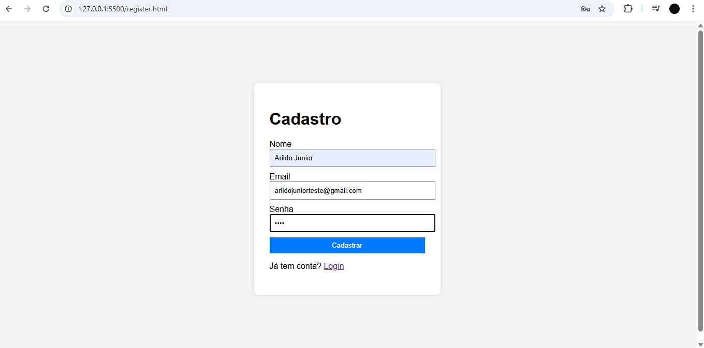
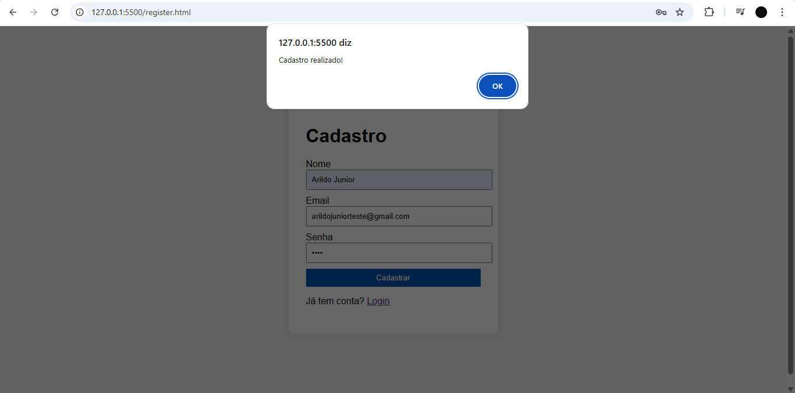
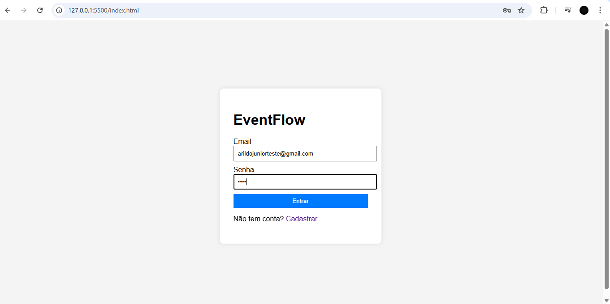
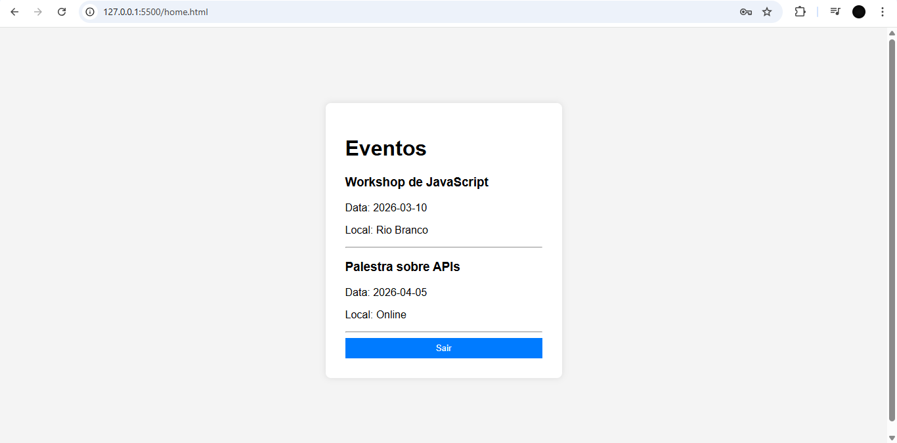

# EventFlow Web 🚀

Aplicação Web para gerenciamento e visualização de eventos, desenvolvida como projeto final para a disciplina de Desenvolvimento Web (Optativa 2302024.4).

---

## 📸 Demonstração do Sistema (Prints)
Conforme solicitado pelo Professor Juan Carlos, seguem as capturas de tela das principais funcionalidades:

## 📸 Demonstração do Sistema (Prints)

### Tela de Login


### Tela de Cadastro e Validação



### Tela de Login Preenchida


### Listagem de Eventos (Página Inicial - Consumindo JSON via Fetch)

---

## 🛠️ Tecnologias Utilizadas
* **HTML5**: Estruturação semântica.
* **CSS3**: Estilização moderna.
* **JavaScript (Vanilla)**: Lógica de autenticação e manipulação do DOM.
* **JSON/Fetch API**: Consumo de dados dinâmicos para a lista de eventos.

---

## 🚀 Processo de Instalação e Execução Local
Para rodar o sistema corretamente no seu computador, siga estes passos:

1. **Clonar o repositório**:
   Abra seu terminal (CMD ou PowerShell) e digite:
   ```bash
git clone https://github.com/junior777-maker/eventflow-web.git
